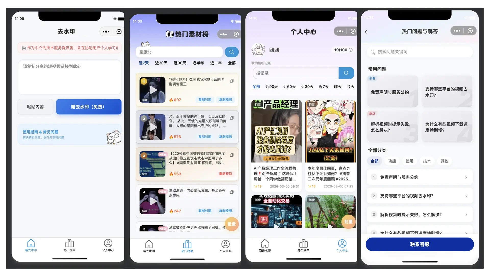

<div align="center">

# 去水印小程序 (media-parser-mp)

<p align="center">
  
</p>

**高性能多平台短视频去水印微信小程序前端（Starter 极简版）**

[](LICENSE) [](https://mp.weixin.qq.com/) [](https://developer.mozilla.org/en-US/docs/Web/JavaScript) [](#💎-核心功能逻辑)

<p align="center">
<a href="#-核心功能逻辑">功能逻辑</a> •
<a href="#-快速开始">部署指南</a> •
<a href="#-联系作者">联系作者</a>
</p>

去水印小程序是一款专为创作者打造的**短视频素材获取工具**。

通过简洁的交互界面，支持抖音、快手、小红书等主流平台，助你一键获取无水印高清视频。

**后端源码**: [https://github.com/ucmao/parse-ucmao-backend](https://github.com/ucmao/parse-ucmao-backend)

</div>

## 💎 核心功能逻辑

### **无损去水印流程**：
* **智能提取**：粘贴分享链接后，前端通过 API 调用后端 `/api/parse` 接口。
* **高清下载**：支持将处理后的无水印视频或封面直接保存至手机系统相册。


### **极简代码结构**：
* **去除冗余页面**：本 Starter 版本只保留了主页和播放页，去除了复杂的排名和个人中心。
* **无加密门槛**：去除了原先动态的请求签权和防网络刷量机制，回归淳朴的 `wx.request`，大幅缩减阅读代码的负担。

---

## 💾 技术栈矩阵

| 维度 | 技术选型 | 说明 |
| --- | --- | --- |
| **底层框架** | **微信小程序原生框架** | 确保最佳性能与原生交互体验 |
| **核心语言** | JavaScript, WXML, WXSS | 标准小程序开发技术栈 |
| **基础库版本** | 3.10.1+ | 适配最新微信 API 特性 |
| **构建工具** | 微信开发者工具 | 官方标准开发与调试环境 |

---

## 🚀 快速开始

### 1. 🚨 重要配置警告

在运行项目前，请务必完成以下替换：

* **AppID**：在 `project.config.json` 中填入你自己的微信小程序 AppID。
* **API 域名**：修改 `utils/config.js` 中的 `baseURL`，指向你部署好的后端服务地址。

### 2. 获取源码

```bash
git clone https://github.com/ucmao/media-parser-mp.git
cd media-parser-mp

```

### 3. 导入项目

1. 打开 **微信开发者工具**。
2. 点击 **「导入」**，选择本项目根目录。
3. 确认 AppID 无误后点击导入。

### 4. 预览调试

点击工具上方的 **「编译」** 按钮，即可在模拟器中体验去水印流程。

---

## 📂 项目结构

```text
media-parser-mp/
├── pages/                  # 业务页面目录
│   ├── index/             # 首页：链接输入与解析核心页
│   └── videoPlayer/       # 播放：预览去水印后的视频
├── utils/                 # 工具类封装
│   ├── request.js         # 核心：标准网络请求
│   ├── file.js            # 功能：处理文件下载与相册保存
│   ├── clipboard.js       # 辅助：处理剪贴板粘贴逻辑
│   └── util.js            # 算法：字符串处理等工具
├── images/                 # 静态资源图标与背景
├── app.js/json/wxss        # 小程序全局逻辑、配置与样式
└── project.config.json     # 开发者工具项目配置文件
```

---

## 📩 联系作者

如果您在安装、使用过程中遇到问题，或有定制需求，请通过以下方式联系：

* **微信**：csdnxr
* **QQ**：294323976
* **邮箱**：leoucmao@gmail.com
* **Bug反馈**：[GitHub Issues](https://github.com/ucmao/media-parser-mp/issues)

---

## ⚖️ 开源协议 & 免责声明

1. 本项目基于 **[MIT LICENSE](LICENSE)** 协议开源。
2. **免责声明**：本项目仅供技术研究和学习交流使用。严禁用于任何违反法律法规的行为，由滥用本项目造成的后果由使用者自行承担。

**去水印小程序** - 高效解析，赋能创作。 🎬✨

---
